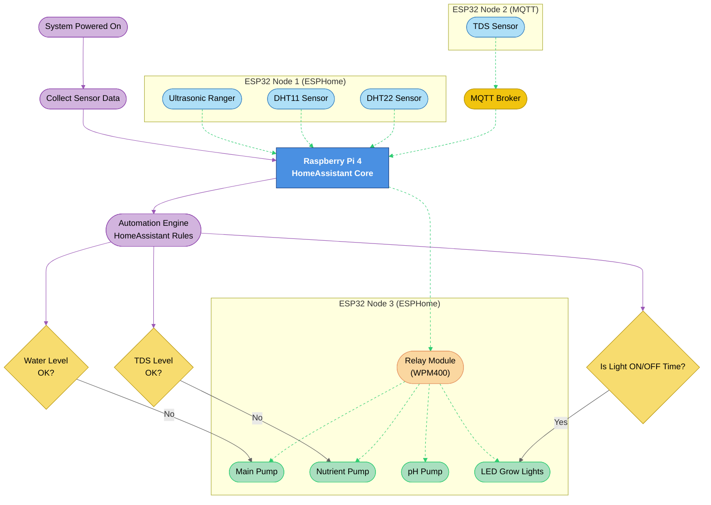

# **Project-VertiFarm: Vertical Farming System for Home Environment**

## Overview

This vertical farming system is designed for small-scale, home-based plant cultivation using automation and smart control technologies. It integrates environmental sensing, nutrient control, and irrigation management using a combination of Raspberry Pi, ESP32 microcontrollers, and HomeAssistant. The system is energy-efficient, modular, and scalable, housed within a custom-built cabinet with support for hydroponic-style growing.

### System Features

- 🌡️ **Environmental Monitoring**: Real-time temp & humidity feedback.
- 💧 **Smart Irrigation**: Based on tank level and timer schedules.
- ⚗️ **Nutrient Management**: TDS-based auto-dosing of nutrients and pH.
- 💡 **Automated Lighting**: Daily grow cycle via timer-controlled relays.
- 📊 **HomeAssistant Dashboard**: Full control, monitoring, and automation logic.

### Descriptive Insight

The vertical farming system leverages edge computing and IoT frameworks to create a responsive and sustainable growing environment. By modularizing the control using multiple ESP32 nodes, the system remains scalable and failsafe—if one node goes offline, others continue functioning independently.

Using HomeAssistant as the central brain ensures smooth automation logic without needing cloud access, promoting privacy and control. MQTT enables lightweight communication with sensors not directly compatible with ESPHome, like the TDS module, ensuring real-time monitoring and timely responses.

The choice of peristaltic pumps for nutrient and pH delivery provides accurate dosing, crucial for maintaining optimal plant health. Water level sensing using ultrasonic modules prevents dry-run scenarios for pumps, and the submersible pump circulates nutrient-rich water through the channels for plant uptake.

LED grow lights are scheduled to mimic day/night cycles and tuned to plant needs, providing efficient energy use. The cabinet ensures neat housing and minimizes external light interference or heat loss. 

   

## System Architecture

### 🧱 System Node Table

| Node              | Role               | Components / Modules                                   | Communication     |
|-------------------|--------------------|---------------------------------------------------------|-------------------|
| **Raspberry Pi 4** | Central Controller | - Hosts **HomeAssistant Core**                          | Central Hub       |
| **ESP32 Node 1**   | Sensor Node        | - DHT22 (Temp & Humidity)    - DHT11 (Temp & Humidity)   - Ultrasonic Ranger (Water Level) | ESPHome → HomeAssistant |
| **ESP32 Node 2**   | Sensor Node        | - TDS Sensor (Velleman WPM356)                          | MQTT → HomeAssistant |
| **ESP32 Node 3**   | Actuator Node      | - Relay Module (Velleman WPM400)   Controls: <ul><li>Main Pump</li><li>Nutrient Pump</li><li>pH Pump</li><li>LED Grow Lights</li></ul> | ESPHome → HomeAssistant |

### Data Flow Summary

- **Sensor Data**:
  - Environmental data (temperature, humidity, water level) is collected via ESPHome and pushed to HomeAssistant in real-time.
  - TDS sensor data is transmitted over **MQTT** to HomeAssistant for nutrient level monitoring.

- **Device Control**:
  - HomeAssistant issues control signals to the actuator ESP32 via ESPHome to manage:
    - Water flow (main submersible pump)
    - Nutrient dosing (peristaltic pump)
    - pH- dosing (peristaltic pump)
    - Lighting (LED grow lights)

- **Automation Logic**:
  - Resides in HomeAssistant, which responds to sensor inputs to trigger actions (e.g., refill water, dose nutrients, adjust lighting schedules).    

## Technologies and Components Used

- **Raspberry Pi 4**: Hosts HomeAssistant for centralized automation and monitoring.
- **ESP32-C6-DevKitC-1**: Handles sensor data and relay control.
- **ESPHome**: Used for seamless integration of ESP32 nodes with HomeAssistant.
- **MQTT**: For transmitting TDS sensor data (non-ESPHome compatible).
- **Custom 3D-Printed Components**: Mechanical support for mounting and water channels.

### Sensors & Modules

| Component                           | Function                                 | Interface          |
|------------------------------------|------------------------------------------|--------------------|
| **Waveshare DHT22 & DHT11**        | Temperature and humidity monitoring      | ESPHome (ESP32)    |
| **Waveshare Ultrasonic Ranger**    | Water level detection in tank            | ESPHome (ESP32)    |
| **Velleman WPM356 (TDS Sensor)**   | Measures total dissolved solids in water | MQTT (ESP32)       |
| **Velleman WPM400 (Relay Module)** | Controls pumps and lighting              | ESPHome (ESP32)    |

### Actuators

| Device                                    | Purpose                    | Power Source  |
|------------------------------------------|----------------------------|---------------|
| **SEAFLO 16LPM 12V Submersible Pump**    | Main water circulation     | 12V supply    |
| **VMA447 Mini Peristaltic Pumps (2x)**   | Nutrient and pH delivery   | 6V supply     |
| **NelsonGarden LED Plant Lights (2x)**   | Plant growth illumination  | 24V supply    |

### Power Supplies

- **5V DC** – ESP32 devices
- **6V DC** – Peristaltic pumps
- **12V DC** – Submersible water pump
- **24V DC** – LED grow lights

Each power supply is selected based on device voltage and current requirements, routed through the relay module for automated switching.

### Additional Components

- **Water Tank**: 25L capacity for hydroponic reservoir.
- **Nutrient & pH Tanks**: 1L each for solution control.
- **Hosing & Couplings**: Water distribution channels.
- **Cabinet Housing**: Custom-designed, houses entire setup.
- **Water Channels**: Supports vertical growth and drainage.

## Future Improvements

- Integration with cloud services for remote access
- Addition of camera module for plant health monitoring
- Automated refill system for water/nutrient tanks
- Voice assistant integration for hands-free control

## License

This documentation and system design are open for personal and educational use.

